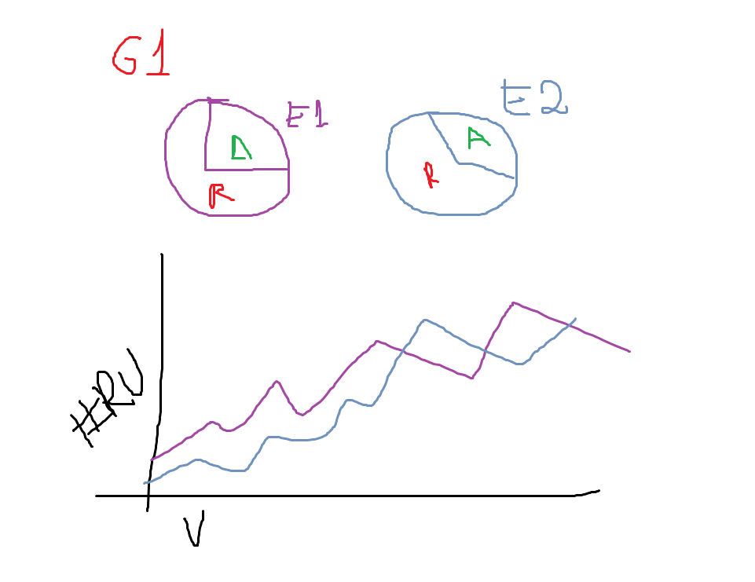
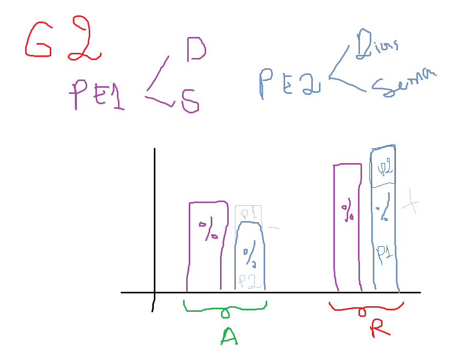
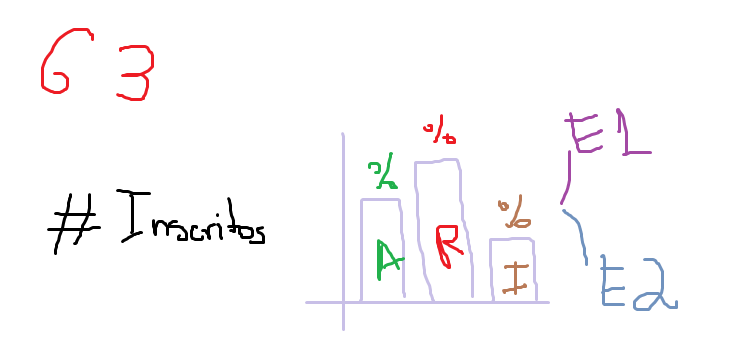
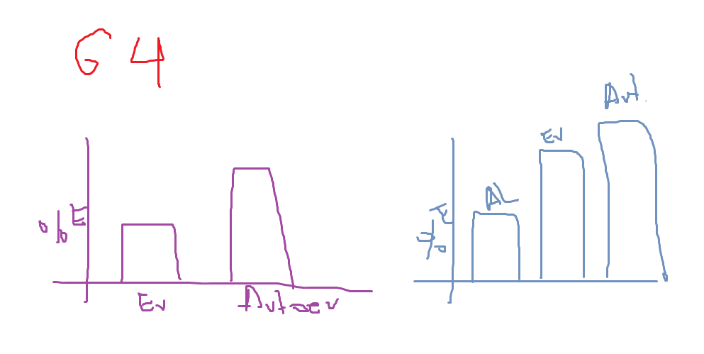

## Preguntas por hacer

Los videos implementados han causado algun cambio en el porcentaje de aprobados y reprobados, en comparacion con la primera edicion?

> Morado edicion 1, Celeste Edicion 2, R % Reprobados, A % Aprobados, #RU Num de reproducciones unicas (Contar las reproducciones POR CADA usuario)

Ha habido alguna consecuencia al alargar el plazo para que los estudiantes puedan culminar el curso? Si fue asi, es significativo en comparacion con la edicion 1?

Hay alguna relacion en base al tiempo y el numero de aprobados y reprobados, en ambas ediciones? (Tomar en cuenta cada semana)

> PE1 Plazo Edicion 1, PE2 Plazo Edicion 2 (En ambas detallar dias y semanas). Conjunto de barras agrupadas en Aprobados y Reprobados, claro, en Porcentaje.

Hay alguna tendencia en subir o decrementar proporcionalmente el numero de estudiantes totalmente inactivos en base al numero de estudiantes inscritos? (Practicamente ver si entre mas inscritos hay mas porcentaje de estudiantes que tienen un cero absoluto)

> Esta grafica mostraria, el numero de incritos en letras grandes, y al lado una grafica que muestre el porcentaje de aprobados, reprobados y estudiantes inactivos (cero absoluto)

Las actividades ludicas motivaron a los estudiantes a realizar el resto de actividades? (Hacer una grafica en porcentaje por semana, para visualizar porcentaje de estudiantes que por semana hicieron las actividades ludicas, las evaluaciones y autoevaluaciones. Comparando ambas ediciones)

